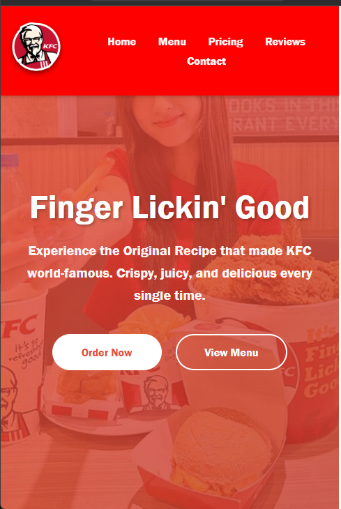

# KFC Cambodia Website
**Student Name: Pheav Chhengthai**

## Live Demo
[GitHub Pages](https://sys-thai69.github.io/fullstack-kfc-website/html.html)

## Screenshots

### Desktop

### Mobile

## Features
- Responsive navigation with hamburger menu
- Hero section with gradient background and CTA buttons
- Scrollable menu section with 7 items (x-axis scroll)
- Pricing section with 3 plans using Flexbox and its element
- Customer reviews carousel
- Footer with social media links and some information
- Fully responsive

## Image Credits
- KFC Logo: [KFC Cambodia Official](https://kfc.com.kh/)
- Food Images: KFC promotional materials

## Fonts
- Franklin Gothic Medium, Arial (System fonts)

## How to Run Locally
1. Download or clone the project
2. Open html.html in the browser

## Technologies
- HTML5
- CSS3 (Flexbox, Grid, Media Queries)

