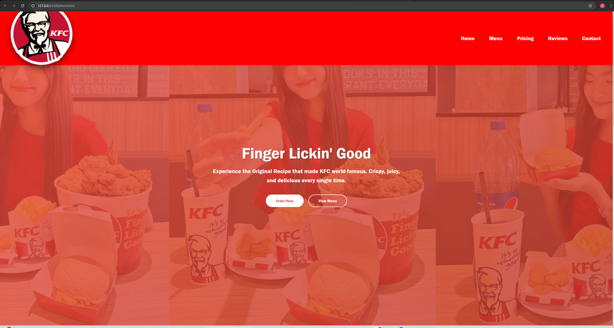

# KFC Cambodia Website
**Student Name: [Your Full Name]**

## Live Demo
[View on GitHub Pages](https://yourusername.github.io/kfc-cambodia)

## Screenshots

### Desktop

### Mobile

## Features
- Responsive navigation with hamburger menu (mobile)
- Hero section with gradient background and CTA buttons
- Scrollable menu section with 7 items
- Pricing section with 3 plans using Flexbox
- Customer reviews carousel (CSS-only)
- Footer with social media links
- Fully responsive (mobile, tablet, desktop)

## Image Credits
- KFC Logo: [KFC Cambodia Official](https://kfc.com.kh/)
- Food Images: KFC promotional materials

## Fonts
- Franklin Gothic Medium, Arial (System fonts)

## How to Run Locally
1. Download or clone the project
2. Open `html.html` in the browser

## Technologies
- HTML5
- CSS3 (Flexbox, Grid, Media Queries)
- No JavaScript or frameworks used

